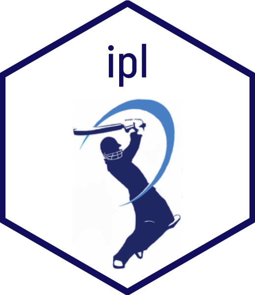

<!-- README.md is generated from README.Rmd. Please edit that file -->

```{r, include = FALSE}
knitr::opts_chunk$set(
  collapse = TRUE,
  comment = "#>",
  fig.path = "man/figures/README-",
  out.width = "100%"
)
```

## ipl 

<!-- badges: start -->
[](https://lifecycle.r-lib.org/articles/stages.html#experimental)
[](https://CRAN.R-project.org/package=ipl)
[](https://github.com/Swaha294/ipl2/actions)
<!-- badges: end -->

The goal of `ipl` is to provide data and functions related to the Indian Premier Leage (IPL) matches and standard cricket statistics. This package allows users to avail of IPL data and conduct analysis of cricketers and IPL teams using functions of this package.

This is package is important because there isn't a consolidated database where one can find all the data to analyse past IPL matches and players. These functions will also aid in conducting data analysis for those who are interested in analysing IPL trends.


## Description

The `ipl` R package consists of datasets on all IPL matches played in the years 2008-2020, and provides functions to calculate typical crickets statistics. 

Our package includes datasets on IPL matches played and cricketers in the years 2008-2020, acquired primarily from [Kaggle](https://www.kaggle.com/), which have been cleaned so users can use it directly for data analysis. Moreover, it comprises functions for analysis of individual cricketers and games, as well as summary statistics for the same.


## Installation

You can install the development version of ipl like so:

``` {r}
remotes::install_github("Swaha294/ipl")
```


## Datasets Included

- `deliveries`: Ball-by-ball data of IPL matches played in 2008-2020 
- `teams`: Winning team, overs bowled, runs made and wickets fallen for each match played by each IPL team in 2008-2020
- `ipl`: More information on matches from 2008 to 2020
- `batsman_100`: Information of top 100 batsmen of IPL
- `bowlers_100`: Informayion of top 100 bowlers of IPL


## Functions Included

The following functions allow for individual analyses of cricketers and IPL matches, as well as for combined statistical analysis of the same.

- `bat_avg` \~ 134,112 B
- `bat_max` \~ 113,136 B
- `batsman_summary` \~ 130,616 B
- `bowler_score` \~ 81,216 B
- `bowler_summary` \~ 90,000 B
- `cents_halfcents` \~ 120,688 B
- `fours` \~ 87,072 B
- `overs_balls` \~ 90,600 B
- `overs` \~ 77,240 B
- `partnership_runs` \~ 93,000 B
- `runs` \~ 76,984 B
- `sixes` \~ 87,072 
- `strike_rate` \~ 118,520 B
- `toss_choice` \~ 87,016 B
- `wickets_taken` \~ 77,888 B
- `winloss` \~ 120,768 B


## Example

This is a basic example which shows you how to solve a common problem:

Load `ipl` R package
```{r load package}
library(ipl)
```

1. Calculate Virat Kohli's batting average in the 2016 season
```{r}
bat_avg("V Kohli", 2016)
```

2. Calculate the maximum runs made by Virat Kohli in a match in the 2016 IPL season
```{r}
bat_max("V Kohli", 2016)
```

3. Calculate the number of centuries and half-centuries made by Virat Kohli in the 2016 IPL season
```{r}
cents_halfcents("V Kohli", 2016)
```

4. Calculate Virat Kohli's strike rate in the 2016 IPL season
```{r}
strike_rate("V Kohli", 2016)
```

5. Calculates the number of times a team chooses to start batting and fielding
```{r}
toss_choice("Delhi Daredevils")
```

6. Find the list of bowlers with bowling average above 40
```{r}
bowler_score(40)
```

7. Calculate Rahul Sharma's overs
```{r}
overs("Rahul Sharma")
```

8. Find Rohit Sharma's total number of sixes in the 2016 IPL season
```{r}
sixes("RG Sharma", 2016)
```

9. Find Suresh Raina's total number of fours in the 2012 IPL season
```{r}
fours("SK Raina", 2012)
```

10. Calculate the number of runs conceded by a given bowler across all IPL 
matches from 2008-2020
```{r}
runs("Rahul Sharma")
```

11. Calculate the number of wickets taken by a given bowler across all IPL 
matches from 2008-2020
```{r}
wickets_taken("Rahul Sharma")
```

12. Calculate the number of complete overs and the remaining (legal) balls bowled 
by Rahul across all IPL matches from 2008-2020
```{r}
overs_balls("Rahul Sharma")
```

13. Visualize the number of runs made by Mumbai Indians in their match against
Delhi Capitals on 2019-03-24, by partnerships
```{r}
partnership_runs(1175358, "Mumbai Indians")
```

14. Get the summary table of all batting statistics for MS Dhoni for all IPL matches
he played between 2008 and 2020
```{r}
batsman_summary("MS Dhoni")
```

15. Get the summary table of wins and losses for Sunrisers Hyderabad in 2017
```{r}
winloss("Sunrisers Hyderabad", 2017)
```

15. Get the bowling analysis for Rahul Sharma
```{r}
bowling_analysis("Rahul Sharma")
```


## Contributors

- [Swaha Bhattacharya](https://github.com/Swaha294)
- [Anushree Gosami](https://github.com/agoswa)


