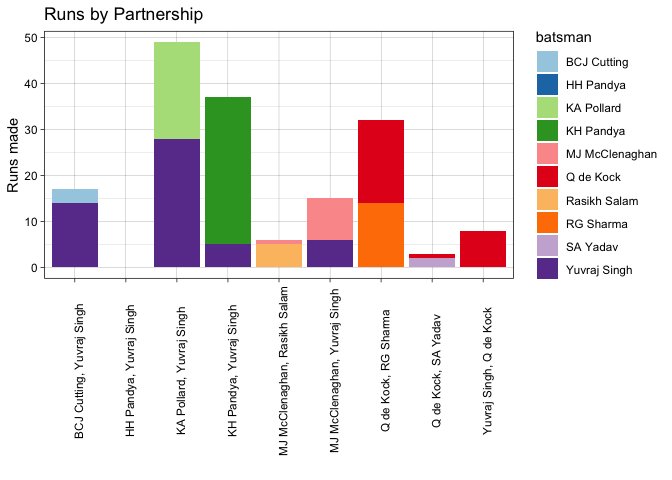

<!-- README.md is generated from README.Rmd. Please edit that file -->

## ipl 

<!-- badges: start -->

[](https://lifecycle.r-lib.org/articles/stages.html#experimental)
[](https://CRAN.R-project.org/package=ipl)
[](https://github.com/Swaha294/ipl2/actions)
<!-- badges: end -->

The goal of `ipl` is to provide data and functions related to IPL
matches and standard cricket statistics. This package allows users to
avail of IPL data and conduct analysis of cricketers and IPL teams using
functions of this package.

## Description

The `ipl` R package consists of datasets on all IPL matches played in
the years 2008-2020, and provides functions to calculate typical
crickets statistics.

Our package includes datasets on IPL matches played and cricketers in
the years 2008-2020, acquired primarily from
[Kaggle](https://www.kaggle.com/), which have been cleaned so users can
use it directly for data analysis. Moreover, it comprises functions for
analysis of individual cricketers and games, as well as summary
statistics for the same.

## Installation

You can install the development version of ipl like so:

``` r
remotes::install_github("Swaha294/ipl")
#> Downloading GitHub repo Swaha294/ipl@HEAD
#> 
#> * checking for file ‘/private/var/folders/0p/hkwpsbqj047d4nq34kz3_wdr0000gn/T/RtmpfUbPPh/remotes7bba1e27d4e4/Swaha294-ipl-f1dec66/DESCRIPTION’ ... OK
#> * preparing ‘ipl’:
#> * checking DESCRIPTION meta-information ... OK
#> * checking for LF line-endings in source and make files and shell scripts
#> * checking for empty or unneeded directories
#> * building ‘ipl_0.0.0.9000.tar.gz’
```

## Datasets Included

-   `deliveries`: Ball-by-ball data of IPL matches played in 2008-2020
-   `teams`: Winning team, overs bowled, runs made and wickets fallen
    for each match played by each IPL team in 2008-2020
-   `ipl`: More information on matches from 2008 to 2020
-   `batsman_100`: Information of top 100 batsmen of IPL
-   `bowlers_100`: Informayion of top 100 bowlers of IPL

## Functions Included

The following functions allow for individual analyses of cricketers and
IPL matches, as well as for combined statistical analysis of the same.

-   `bat_avg` \~ 134,112 B
-   `bat_max` \~ 113,136 B
-   `batsman_summary` \~ 130,616 B
-   `bowler_score` \~ 81,216 B
-   `bowler_summary` \~ 90,000 B
-   `cents_halfcents` \~ 120,688 B
-   `fours` \~ 87,072 B
-   `overs_balls` \~ 90,600 B
-   `overs` \~ 77,240 B
-   `partnership_runs` \~ 93,000 B
-   `runs` \~ 76,984 B
-   `sixes` \~ 87,072
-   `strike_rate` \~ 118,520 B
-   `toss_choice` \~ 87,016 B
-   `wickets_taken` \~ 77,888 B
-   `winloss` \~ 120,768 B

## Example

This is a basic example which shows you how to solve a common problem:

Load `ipl` R package

``` r
library(ipl)
```

1.  Calculate Virat Kohli’s batting average in the 2016 season

``` r
bat_avg("V Kohli", 2016)
#>   batsman year player_runs player_wickets batting_avg
#> 1 V Kohli 2016         973             12       81.08
```

2.  Calculate the maximum runs made by Virat Kohli in a match in the
    2016 IPL season

``` r
bat_max("V Kohli", 2016)
#> # A tibble: 1 × 3
#>    year batsman max_runs
#>   <dbl> <chr>      <dbl>
#> 1  2016 V Kohli      113
```

3.  Calculate the number of centuries and half-centuries made by Virat
    Kohli in the 2016 IPL season

``` r
cents_halfcents("V Kohli", 2016)
#> # A tibble: 1 × 4
#>    year batsman centuries half_centuries
#>   <dbl> <chr>       <dbl>          <dbl>
#> 1  2016 V Kohli         4              7
```

4.  Calculate Virat Kohli’s strike rate in the 2016 IPL season

``` r
strike_rate("V Kohli", 2016)
#> # A tibble: 1 × 3
#>    year batsman strike_rate
#>   <dbl> <chr>         <dbl>
#> 1  2016 V Kohli        152.
```

5.  Calculates the number of times a team chooses to start batting and
    fielding

``` r
toss_choice("Delhi Daredevils")
#> # A tibble: 2 × 2
#>   toss_decision   num
#>   <fct>         <int>
#> 1 bat              29
#> 2 field            51
```

6.  Find the list of bowlers with bowling average above 40

``` r
bowler_score(40)
#> [1] "Murali Kartik" "Tim Southee"   "Suresh Raina"  "Brett Lee"
```

7.  Calculate Rahul Sharma’s overs

``` r
overs("Rahul Sharma")
#> [1] 154.4
```

8.  Find Rohit Sharma’s total number of sixes in the 2016 IPL season

``` r
sixes("RG Sharma", 2016)
#> # A tibble: 1 × 3
#> # Groups:   batsman [1]
#>   batsman    year num_6s
#>   <chr>     <dbl>  <int>
#> 1 RG Sharma  2016     17
```

9.  Find Suresh Raina’s total number of fours in the 2012 IPL season

``` r
fours("SK Raina", 2012)
#> # A tibble: 1 × 3
#> # Groups:   batsman [1]
#>   batsman   year num_4s
#>   <chr>    <dbl>  <int>
#> 1 SK Raina  2012     36
```

10. Calculate the number of runs conceded by a given bowler across all
    IPL matches from 2008-2020

``` r
runs("Rahul Sharma")
#> [1] 1086
```

11. Calculate the number of wickets taken by a given bowler across all
    IPL matches from 2008-2020

``` r
wickets_taken("Rahul Sharma")
#> [1] 40
```

12. Calculate the number of complete overs and the remaining (legal)
    balls bowled by Rahul across all IPL matches from 2008-2020

``` r
overs_balls("Rahul Sharma")
#>         player completed_overs balls
#> 1 Rahul Sharma             154     4
```

13. Visualize the number of runs made by Mumbai Indians in their match
    against Delhi Capitals on 2019-03-24, by partnerships

``` r
partnership_runs(1175358, "Mumbai Indians")
```



14. Get the summary table of all batting statistics for MS Dhoni for all
    IPL matches he played between 2008 and 2020

``` r
batsman_summary("MS Dhoni")
#>    year player_runs player_wickets batting_avg max_runs strike_rate centuries
#> 1  2020         200              8       25.00       47      116.28         0
#> 2  2019         416              5       83.20       84      134.63         0
#> 3  2018         455              7       65.00       79      150.66         0
#> 4  2017         290             13       22.31       61      116.00         0
#> 5  2016         284              8       35.50       64      135.24         0
#> 6  2015         372             14       26.57       53      121.97         0
#> 7  2014         371              5       74.20       57      148.40         0
#> 8  2013         461             11       41.91       67      162.90         0
#> 9  2012         358             11       32.55       51      128.78         0
#> 10 2011         392             10       39.20       70      158.70         0
#> 11 2010         287              9       31.89       66      136.67         0
#> 12 2009         332              8       41.50       58      127.20         0
#> 13 2008         414             10       41.40       65      133.55         0
#>    half_centuries num_4s num_6s
#> 1               0     16      7
#> 2               3     22     23
#> 3               3     24     30
#> 4               1     15     16
#> 5               1     18     14
#> 6               1     27     17
#> 7               1     22     20
#> 8               4     32     25
#> 9               1     26      9
#> 10              2     25     23
#> 11              2     26      8
#> 12              2     22      9
#> 13              2     38     15
```

15. Get the summary table of wins and losses for Sunrisers Hyderabad in
    2017

``` r
winloss("Sunrisers Hyderabad", 2017)
#>   toss_decision wins losses      wpct
#> 1           bat    2      0 1.0000000
#> 2         field    6      6 0.5000000
#> 3         total    8      6 0.5714286
```

15. Get the bowling analysis for Rahul Sharma

``` r
bowling_analysis("Rahul Sharma")
#>         bowler overs runs wickets_taken
#> 1 Rahul Sharma 154.4 1086            40
```

## Contributors

-   [Swaha Bhattacharya](https://github.com/Swaha294)
